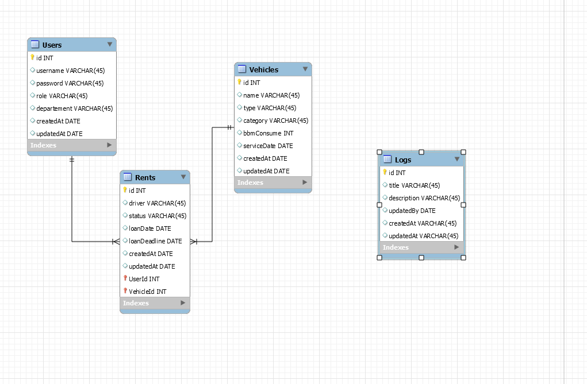

## Account
```js
    // Admin 
{
username : 'admin'
password: '12345678'
},
    // Cabang
{
username : 'maulana'
password: '12345678'
},
{
    // Pusat
username : 'fahmi'
password: '12345678'
},

```
## Database 
    - PostgreSQL 15.1
    - ORM(Sequelize)

## Version
    NodeJs v16.14.0

## Framework
```js
    Backend-side 
    framework:{
        NodeJs,
        ExpressJs,
    },
    Frontend-side
    framework:{
        VueJs
    }
```

## Panduan Aplikasi
  
    // Server Side

    cd server
    npm install
    npx sequelize-cli db:create
    npx sequelize-cli db:migrate
    npx sequelize-cli db:seed:all
    nodemon app

    // Frontend Side
    cd client
    npm install
    npm run dev


## Data Model
    


